## Account Portal

### Tổng quan dự án
Account Portal là hệ thống quản lý tài khoản với chức năng đăng ký, đăng nhập, phân quyền người dùng (User/Admin), quản lý thông tin cá nhân và quản trị user. Dự án gồm hai phần: frontend (React) và backend (Spring Boot).

### Công nghệ sử dụng
- **Frontend:** ReactJS, Vite, Bootstrap, Axios
- **Backend:** Java Spring Boot, Spring Security, JWT, Maven

---

### Frontend gồm các màn hình:
- **Login:** Đăng nhập tài khoản.
- **Register:** Đăng ký tài khoản mới (username, email, password).
- **My Profile:** Xem và cập nhật thông tin cá nhân (ID, username, email, role).
- **User Dashboard:** Trang dashboard cho user thường.
- **Admin Dashboard:** Trang quản trị, xem danh sách user, phân quyền, xóa user.
- **Navbar:** Điều hướng, hiển thị nav động theo role.

---

### Backend gồm các API chính:
- `POST /api/auth/login` — Đăng nhập, trả về JWT token.
- `POST /api/auth/register` — Đăng ký tài khoản mới.
- `GET /api/users/me` — Lấy thông tin user hiện tại (dựa trên token).
- `PUT /api/users/me` — Cập nhật thông tin user hiện tại.
- `GET /api/users` — (Admin) Lấy danh sách toàn bộ user.
- `DELETE /api/users/{id}` — (Admin) Xóa user theo id.

Các API đều yêu cầu xác thực bằng JWT token (trừ đăng ký và đăng nhập).

---

### Hướng dẫn chạy project

#### Backend (Spring Boot)
1. Mở terminal tại thư mục `backend`
2. Chạy lệnh:
   ```bash
   ./mvnw spring-boot:run
   ```
   hoặc (nếu dùng Windows):
   ```bash
   mvnw.cmd spring-boot:run
   ```
3. Server backend sẽ chạy tại `http://localhost:8080`

#### Frontend (ReactJS)
1. Mở terminal tại thư mục `frontend`
2. Cài đặt dependencies:
   ```bash
   npm install
   ```
3. Chạy ứng dụng:
   ```bash
   npm run dev
   ```
4. Truy cập frontend tại `http://localhost:5173`

#### Database

1. Sử dụng cơ sở dữ liệu (MySQL).
2. Cấu hình kết nối database trong file `backend/src/main/resources/application.properties`:
   - Ví dụ cho MySQL:
     ```properties
     spring.datasource.url=jdbc:mysql://localhost:3306/account_portal
     spring.datasource.username=your_db_user
     spring.datasource.password=your_db_password
     spring.jpa.hibernate.ddl-auto=update
     ```
3. Tạo database thủ công (nếu cần):
   ```sql
   CREATE DATABASE account_portal_db;
   ```
4. Khi chạy backend lần đầu, các bảng sẽ được tự động tạo ra.
5. Có thể xem dữ liệu mẫu hoặc quản lý bảng qua các công cụ như phpMyAdmin, DBeaver,...

---

### Ảnh minh họa giao diện

Một số ảnh chụp màn hình thực tế sau khi build và chạy project:

#### Trang đăng nhập
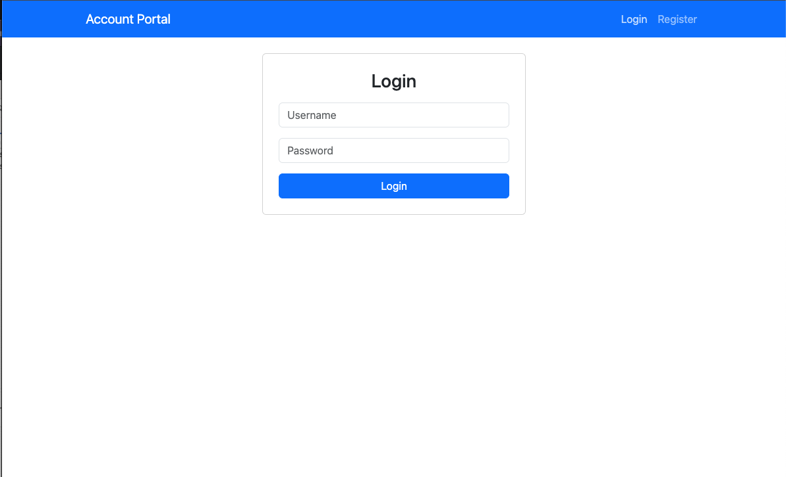

#### Trang đăng nhập - username/password không chính xác
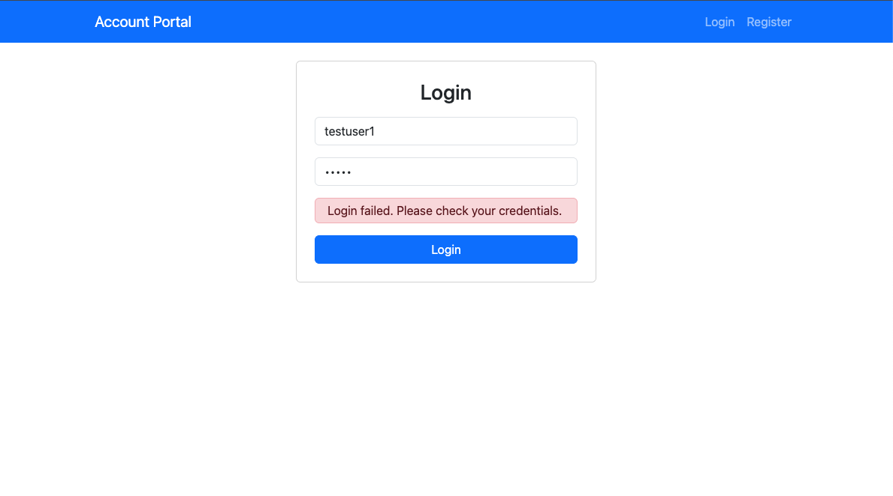

#### Trang đăng ký
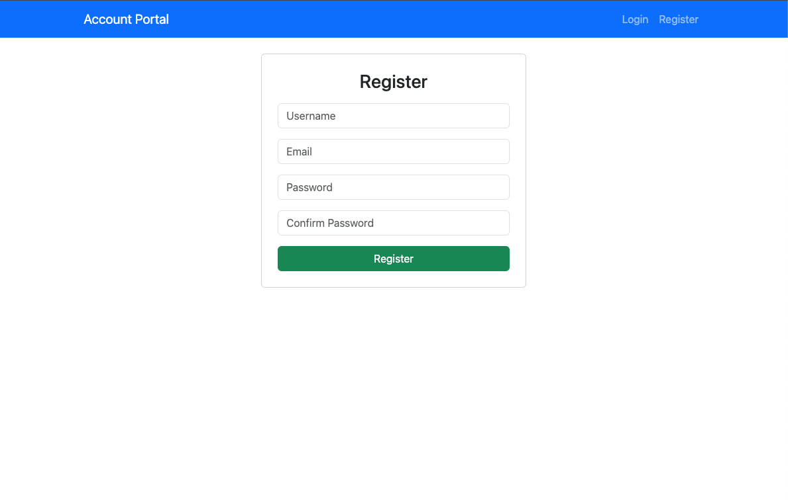

#### Trang đăng ký - user đã tồn tại
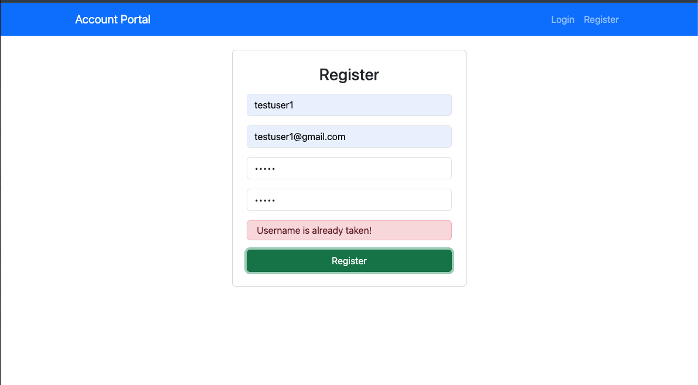

---

#### Giao diện Admin Dashboard (ADMIN)
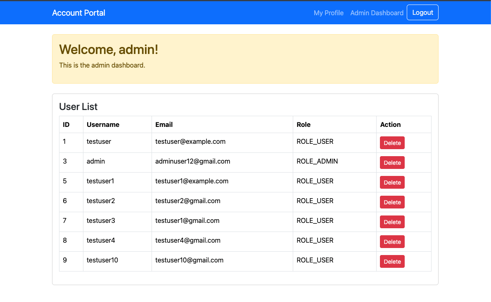

#### Giao diện Admin: Xem & Xóa user (ADMIN)
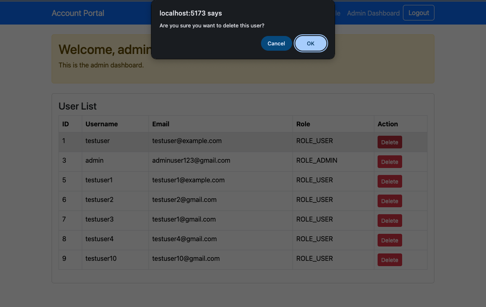
 
#### Giao diện Admin: My Profile (ADMIN)
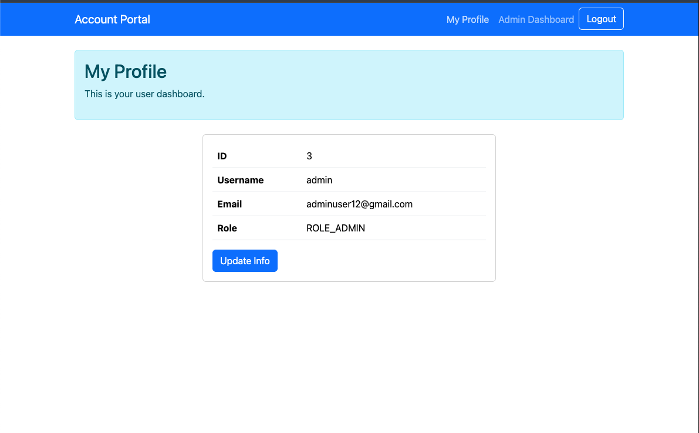

#### Giao diện Admin: Update My Profile (ADMIN)
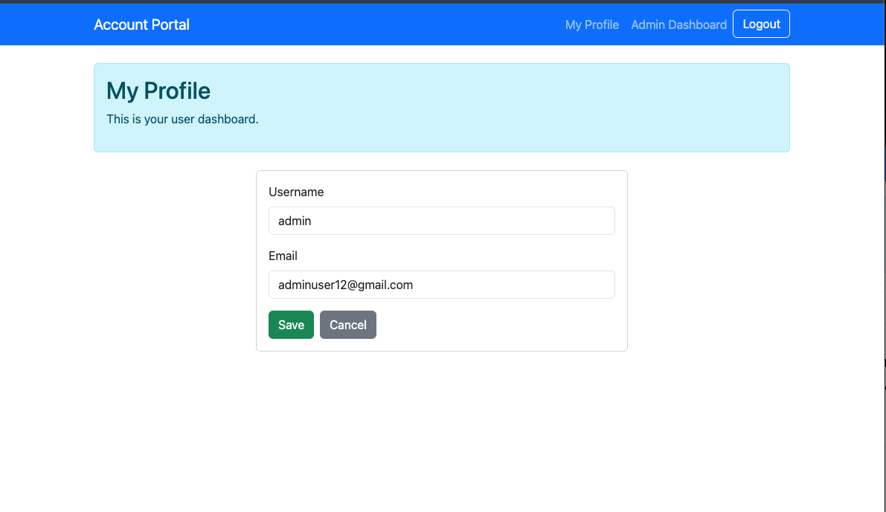

---

#### Giao diện User: My Profile (USER)
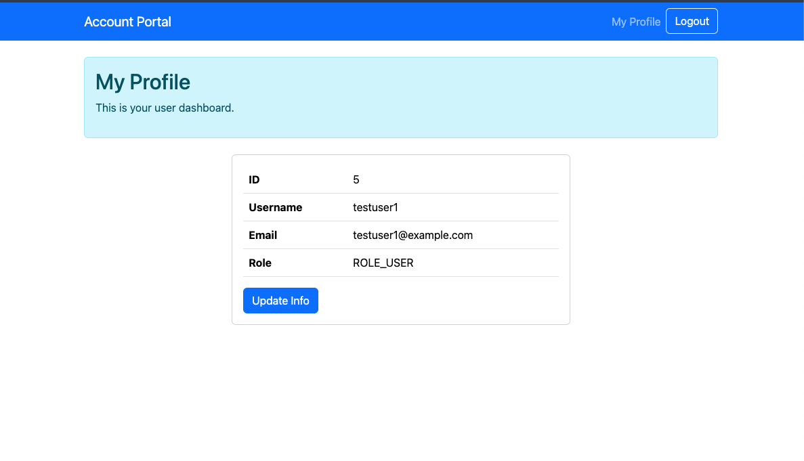

#### Giao diện User: Update My Profile (USER)
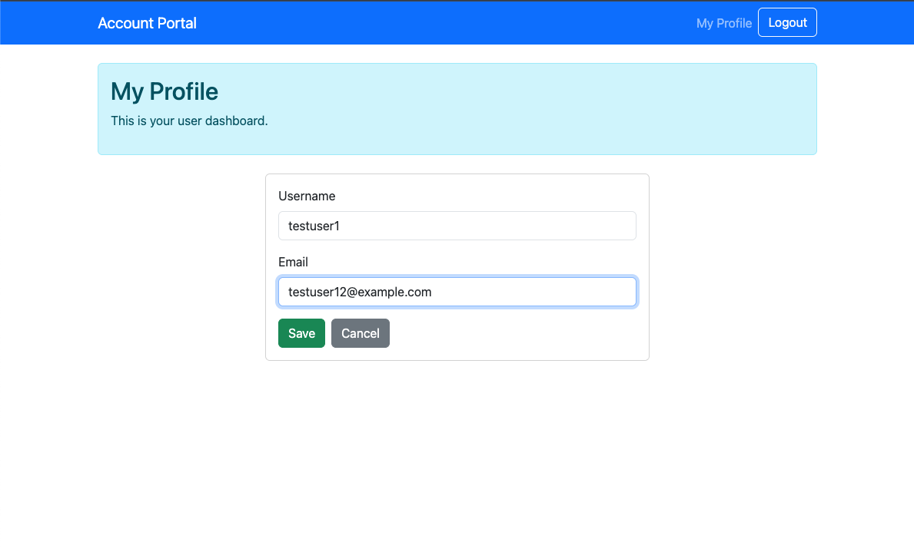

---

#### Bảng users trong database
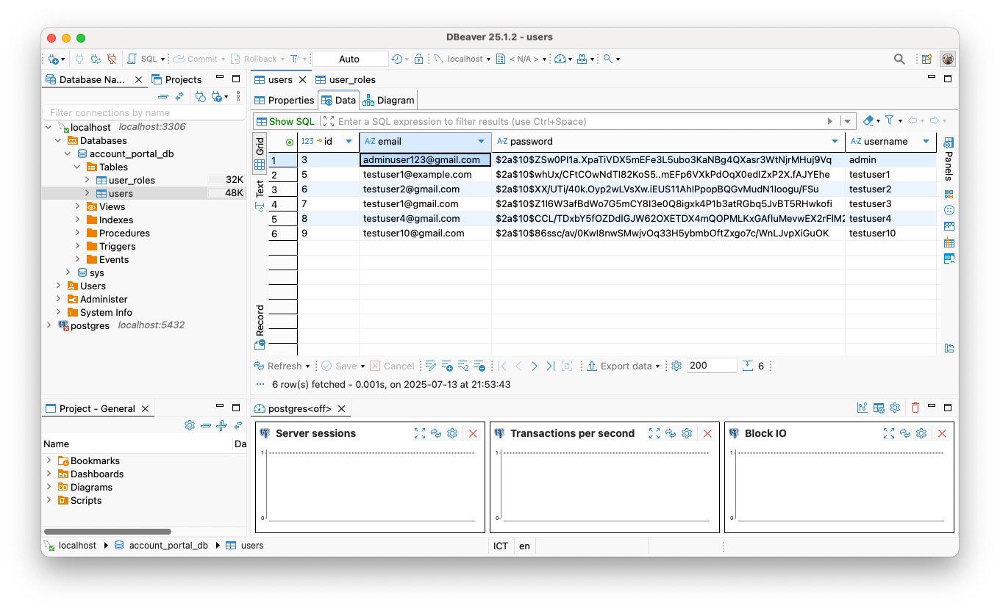

#### Bảng user_roles trong database
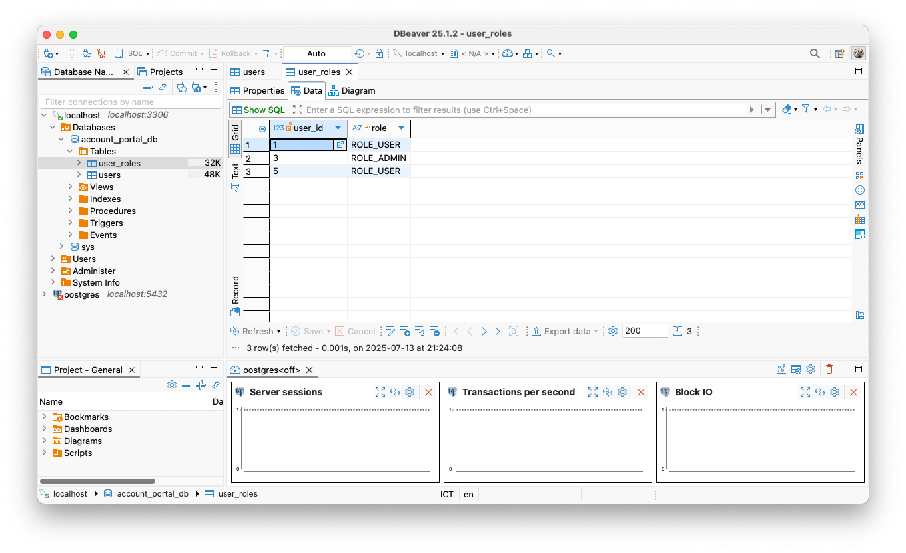

---

## Thank you for reading and following this project!


